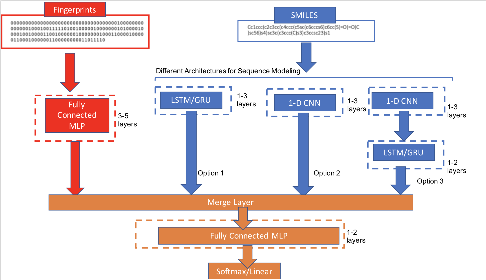

# CheMixNet
CheMixNet is a general-purpose neural network that combines two neural architectures (illustrated below). 
The first neural architecture is a fully connected multi-layer perceptron network trained on molecular fingerprints. 
The second neural architecture have 3 flavors: 
1. CNN
2. RNN (LSTM or GRU)
3. CNN-RNN (CNN followed by LSTM or GRU)

  

The proposed architecture performs better than other state of the art architectures such as SMILES2vec, Chemception, ConvGraph etc. 
