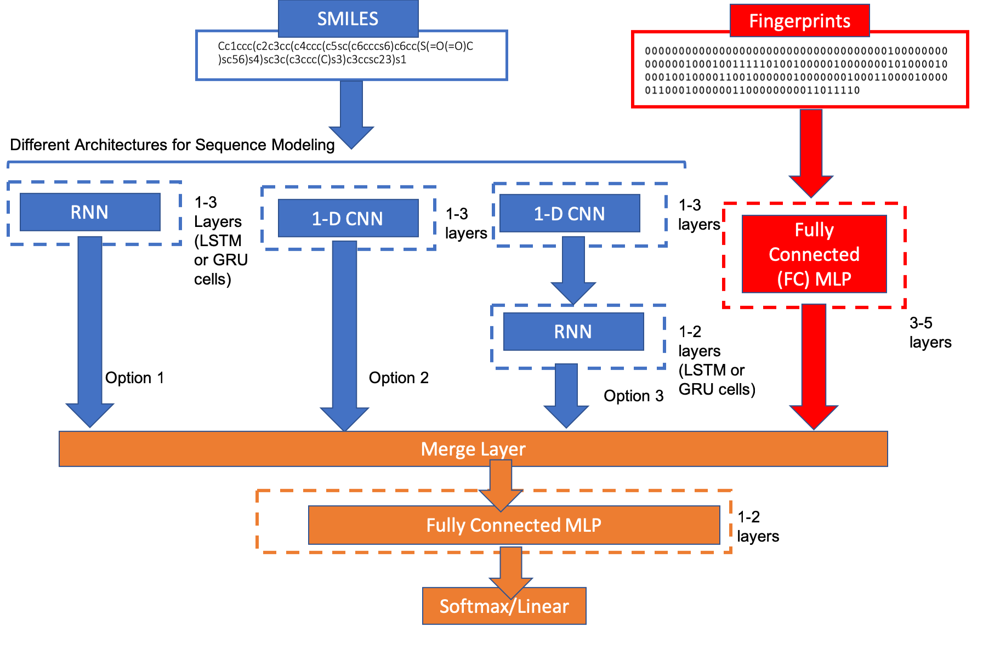

# CheMixNet
CheMixNet is a general-purpose neural network architecture that combines two neural architectures (illustrated below). 
The first neural architecture is a fully connected multi-layer perceptron network trained on molecular fingerprints. 
The second neural architecture is trained on SMILES sequences and have 3 choices for their neural architecture: 
1. CNN
2. RNN (LSTM or GRU)
3. CNN-RNN (CNN followed by LSTM or GRU)

  

The proposed architecture performs better than other state of the art architectures such as SMILES2vec, Chemception, ConvGraph etc. 

Requirements: 
1. Keras 2.0 or higher
2. Tensorflow 1.7 
3. RDKit 2017.09.1
4. Scikit-Learn 0.19.1
5. Numpy 1.14
6. Pandas 0.22

## List of Files

#### Core Files
* chemixnet_util.py : Core module containing CheMixNet architecture 
* run_eval.py : Module for evaluating CheMixNet across datasets 
* dl_util.py : Utility file for running basic deep learning modules
* rdkit_util.py : Utility file for RDKIT functions (RDKIT is a molecular informatics python library)
* ml_util.py : Utility file for running basic machine learning modules

#### Jupyter Notebooks

* eval_esol.ipynb : Notebook for evaluating the results of CheMixNet on the ESOL dataset 
* eval_hiv.ipynb : Notebook for evaluating the results of CheMixNet on the HIV dataset 
* eval_freesolv.ipynb : Notebook for evaluating the results of CheMixNet on the FreeSolv datasets (Experimental and Calculated)
* eval_tox.ipynb : Notebook for evaluating the results of CheMixNet on the Tox21 dataset 

#### Additional Files
* fp_fc.py : Module for fully connected network developed on fingerprints
* smiles_nn.py: Module for CNN or RNN network on SMILES

## Developer Team

The code was developed by the <a href="http://cucis.ece.northwestern.edu/">CUCIS</a> group at the Electrical and Computer Engineering Department at Northwestern University. 

1. Arindam Paul (arindam.paul@eecs.northwestern.edu)
2. Dipendra Jha (dipendra@u.northwestern.edu)
3. Reda Al-Bahrani (reda@u.northwestern.edu)
4. Ankit Agrawal (ankitag@eecs.northwestern.edu)
5. Wei-keng Liao (wkliao@eecs.northwestern.edu)
6. Alok Choudhary (choudhar@eecs.northwestern.edu)

## Citation
If you use this code or data, please cite:

Arindam Paul, Dipendra Jha, Reda Al-Bahrani, Wei-keng Liao, Alok Choudhary, Ankit Agrawal. CheMixNet: Mixed DNN Architectures for Predicting Chemical Properties using Multiple Molecular Representations. Thirty-second Conference on Neural Information Processing Systems (NIPS), 2018, DOI:  https://arxiv.org/abs/1811.08283

## Questions/Comments:

email: arindam.paul@eecs.northwestern.edu or ankitag@eecs.northwestern.edu 
Copyright (C) 2019, Northwestern University. 
See COPYRIGHT notice in top-level directory.

## Funding Support

This work was performed under the following financial assistance awards 70NANB14H012 and 70NANB19H005 from U.S. Department of Commerce, National Institute of Standards and Technology as part of the Center for Hierarchical Materials Design (CHiMaD). Partial support is also acknowledged from DOE awards DE-SC0014330, DE-SC0019358.
